# Soundings

**Soundings** is a calm, fast web app for an organisation's ideas. People submit ideas,
anonymously too through a public form. Each idea gets one accountable **owner** and
several **evaluators**, who score it **blind** against a short rubric. The scores roll
up into a weighted aggregate with a "high disagreement" flag. Strong ideas become a
commercial proposal, exported as a branded PDF or as Markdown. AI agents in
[kagent](https://kagent.dev) can act as an extra evaluator or research assistant
through Soundings' own MCP server.

It is one container image and one Helm chart. PostgreSQL is its only stateful
dependency, it sends mail through any SMTP server and it runs air-gapped. Guiding rule:
**simple beats configurable**.

Version **0.1.0**: [release notes](docs/RELEASE-NOTES.md).

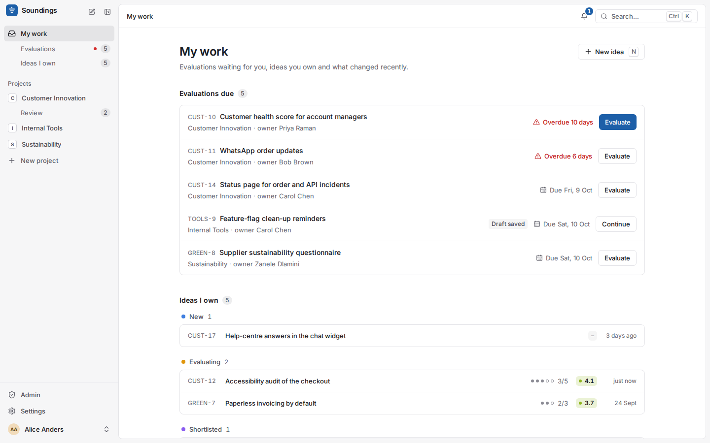

## A tour

| | |
|---|---|
| 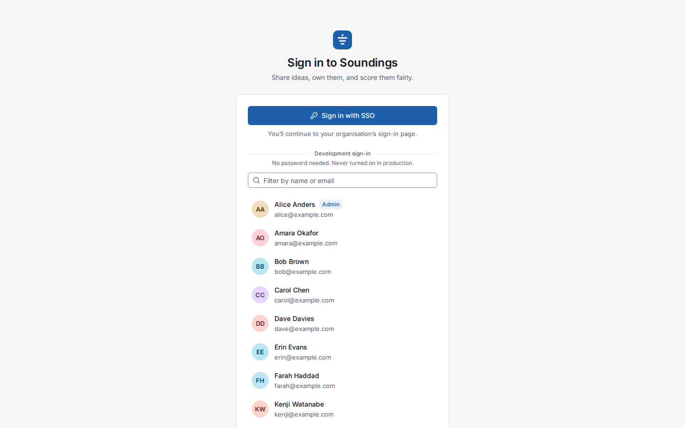 **1. Sign in** with your organisation's single sign-on (OIDC: Keycloak, Entra ID, Google). Project access follows your directory groups. |  **2. My work**: evaluations due (overdue first), the ideas you own by status, and what changed recently. |
| 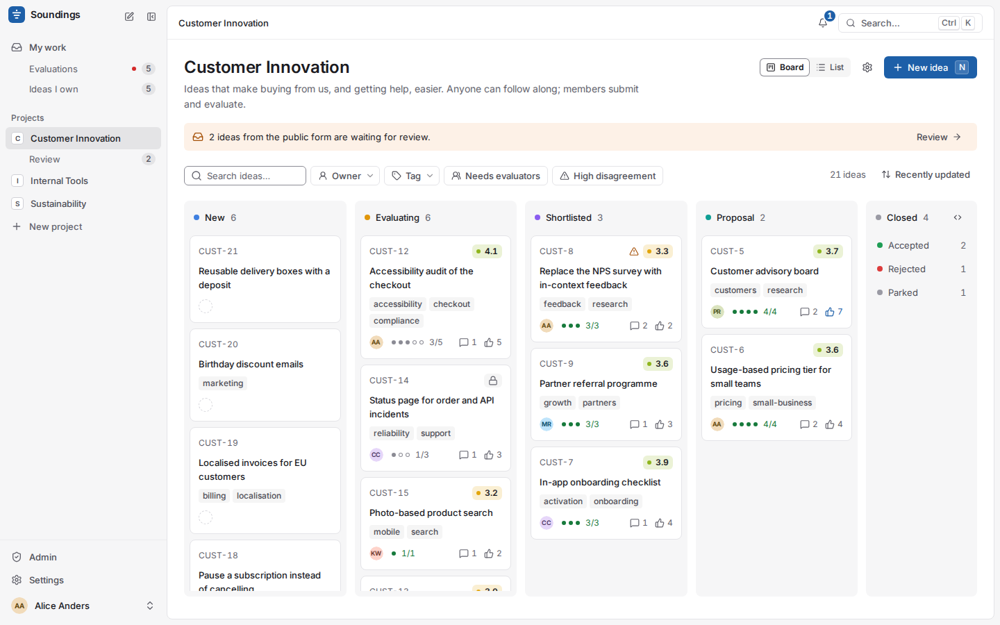 **3. Board and list** for each project, sorted by aggregate score and filtered in a keystroke. It stays fast with 10,000 ideas. | 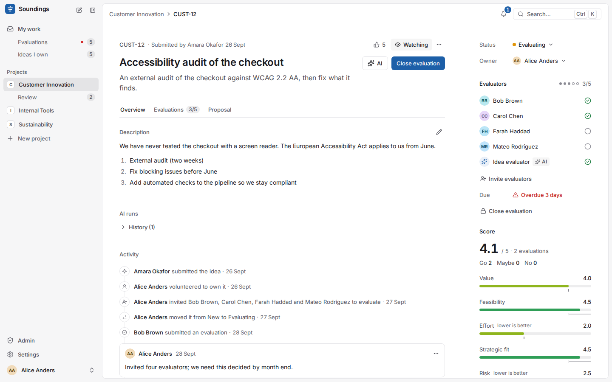 **4. The idea page**: the owner's next step as the one blue button, the activity feed, @mentions and votes. |
| 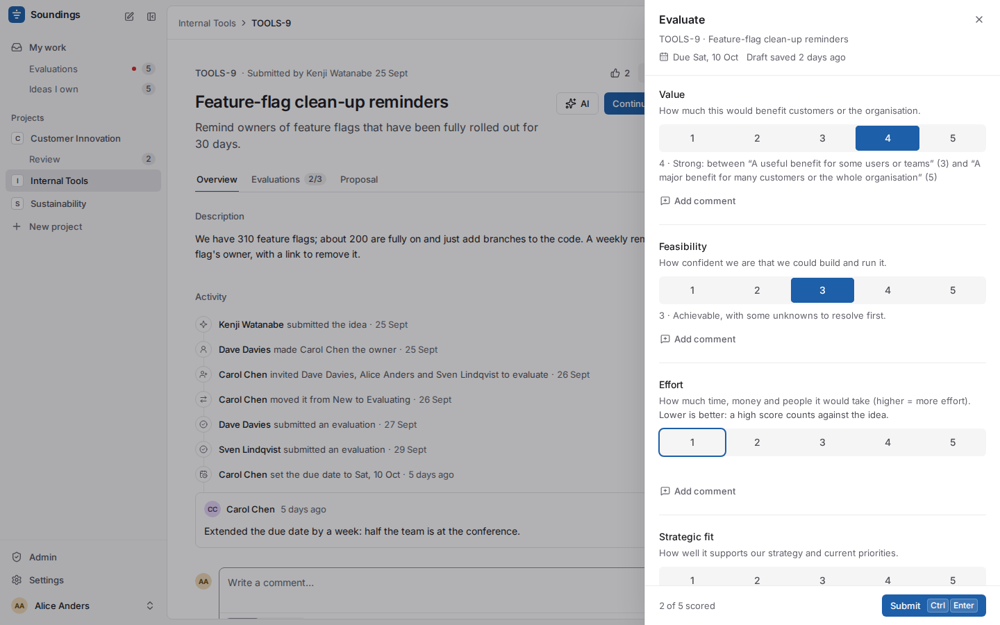 **5. Evaluate blind**: score each criterion 1–5 and recommend Go, Maybe or No. Nobody else's scores are in sight until you submit. | 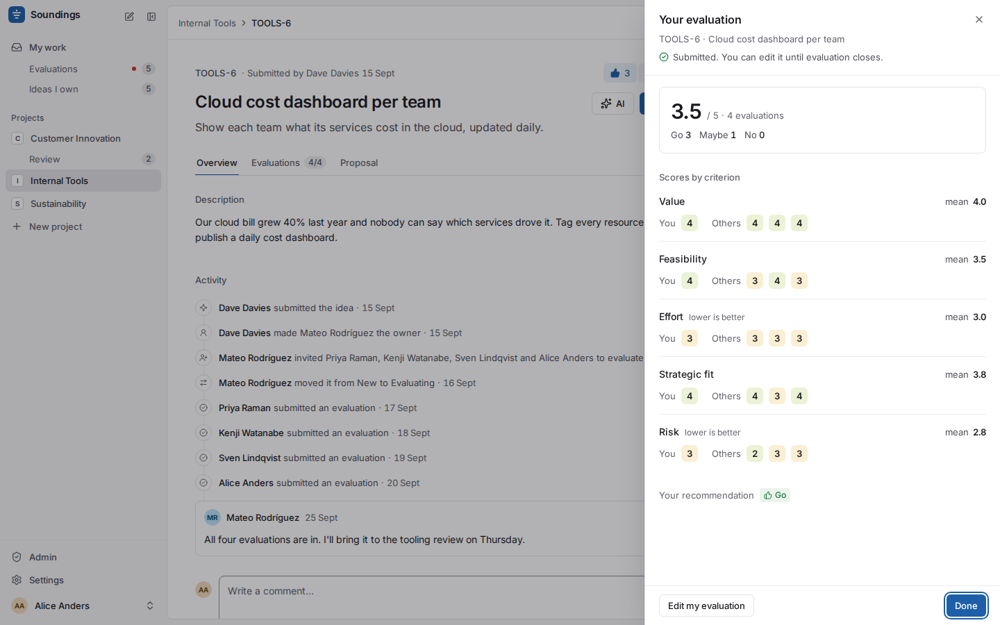 **6. Then see everyone's scores**, the weighted aggregate and where evaluators disagree. |
| 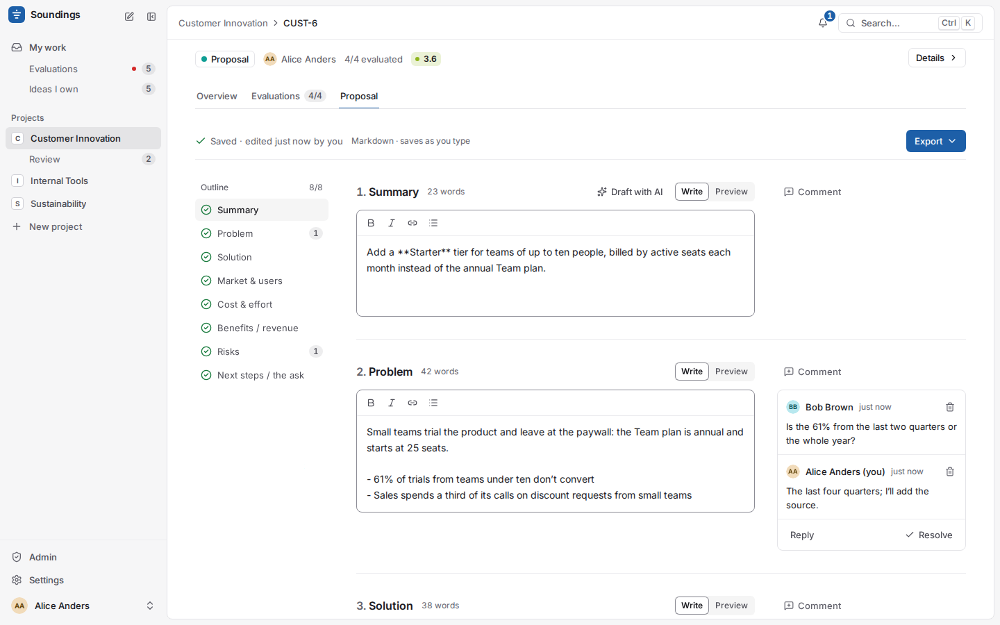 **7. Proposals** from a fixed eight-section template, with comments in the margin and suggestions to accept or discard. | 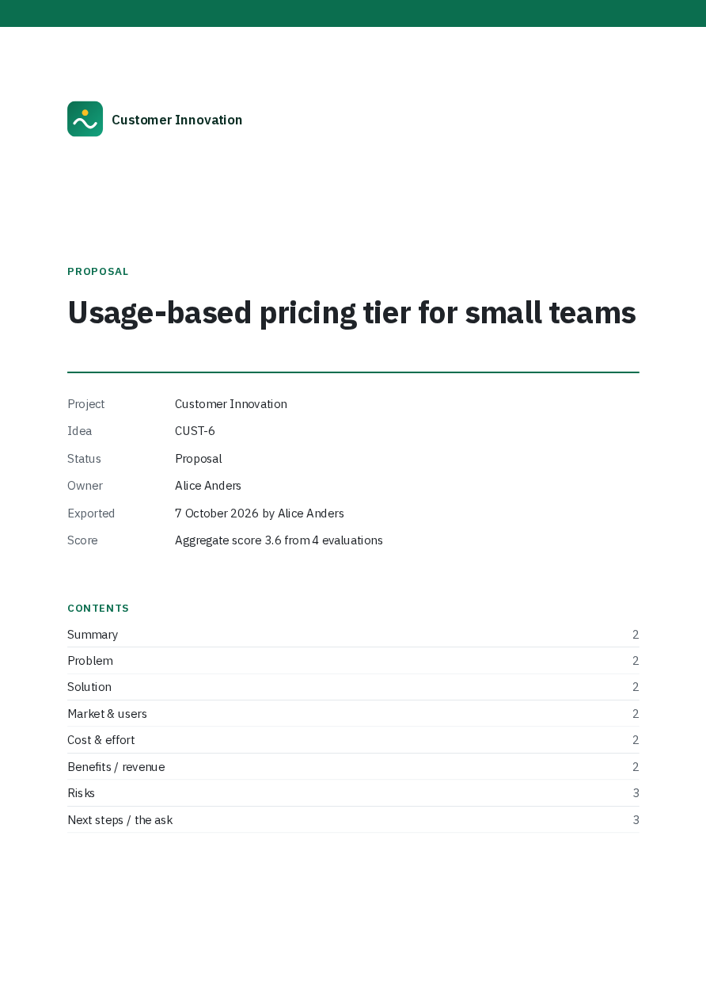 **8. Export** a branded, tagged PDF or Markdown. |
| 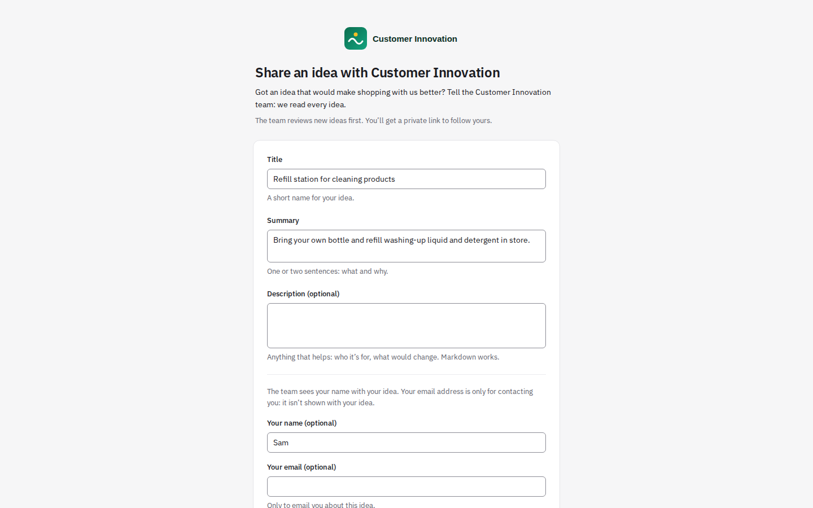 **9. Public form**: anyone can send an idea, protected by a proof of work. Submitters track it through a private link. | 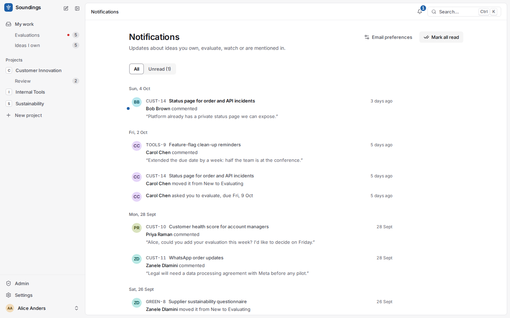 **10. Notifications** in the app and by email, immediately or as a daily digest. ([An email](docs/screenshots/tour/10-email-1440-light.png).) |
| 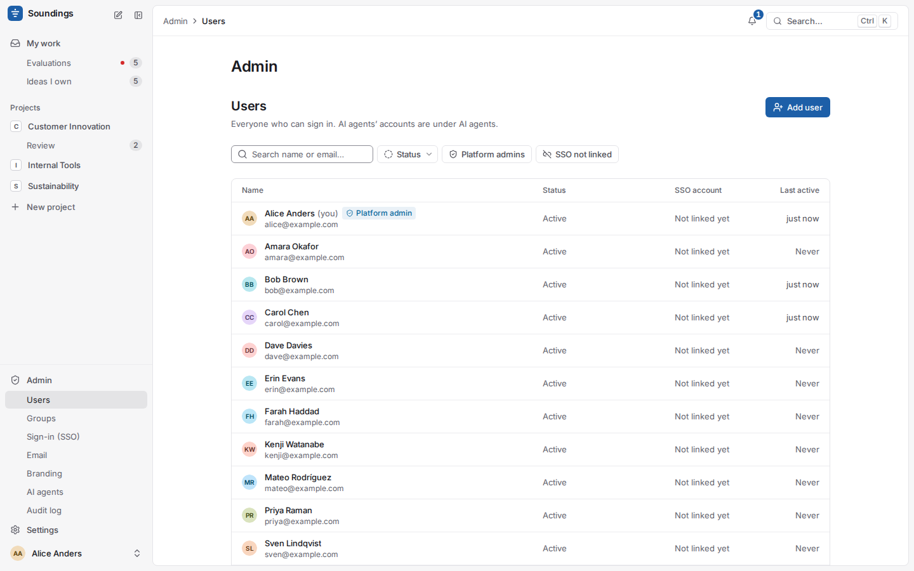 **11. Admin**: users, groups and IdP mappings, single sign-on, branding, email, API keys, AI agents and the audit log. | 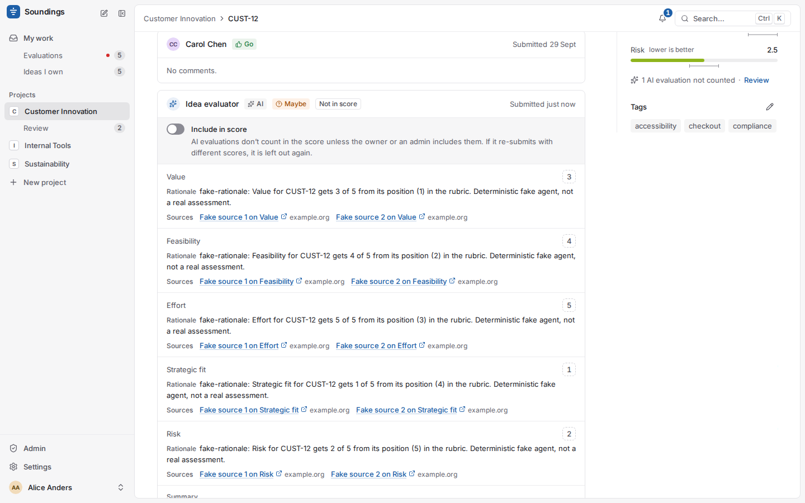 **12. AI evaluation** by a kagent agent: a rationale and cited sources per criterion. It stays out of the score until the owner includes it. (Here Soundings' deterministic stand-in agent wrote it.) |

Dark mode and phone layouts: [docs/screenshots/tour/](docs/screenshots/tour/). Every
screen at 1440 px light and dark, and at 390 px:
[docs/screenshots/](docs/screenshots/) (by phase).

## Quick start

**On your machine** (Docker, about 3 minutes the first time):

```sh
make demo          # build the image, run it with Postgres, the worker, Mailpit and demo data
open http://localhost:8000    # pick a person on the sign-in page (Alice is the admin)
open http://localhost:8026    # Mailpit: every email the demo sends
make demo-down     # remove it all
```

**On Kubernetes** (1.27+, an ingress controller, a default StorageClass): build the
image and push it where your cluster pulls from (`make image IMAGE=<registry>/soundings:0.1.0`),
then:

```sh
helm install soundings ./deploy/helm -n soundings --create-namespace \
  --set 'baseUrls[0]=https://ideas.example.com' --set ingress.enabled=true \
  --set image.registry=<registry>
```

`NOTES.txt` prints the URL and how to sign in with the generated break-glass admin, and
then how to connect single sign-on. The [operator guide](docs/operator-guide.md) covers
the rest: SSO, SMTP, an external database, TLS, the public form, MCP and kagent,
backups, upgrades and what is stored about people.

## Documentation

| | |
|---|---|
| [User guide](docs/user-guide.md) | Everything people do in the app, by task |
| [Operator guide](docs/operator-guide.md) | Installing and running it: Helm, SSO, email, security, operations, data protection |
| [Helm chart](deploy/helm/README.md) | Every value |
| [MCP guide](docs/mcp.md) | Connecting Claude Code, Claude Desktop or an SDK with an API key; the ten tools |
| [kagent integration](deploy/kagent/README.md) | AI agents: how a run flows, example manifests |
| [Release notes](docs/RELEASE-NOTES.md) | What 0.1.0 does, known issues, decisions to confirm |
| [Decisions](docs/decisions.md), [ADRs](docs/adr/README.md) | Why it is built this way |
| [Role matrix](docs/role-matrix.md) | Every permission rule, and the exact blind-evaluation rules |
| [API contract](docs/api/) | REST API per phase (`/api/docs` on a running instance) |

## Architecture

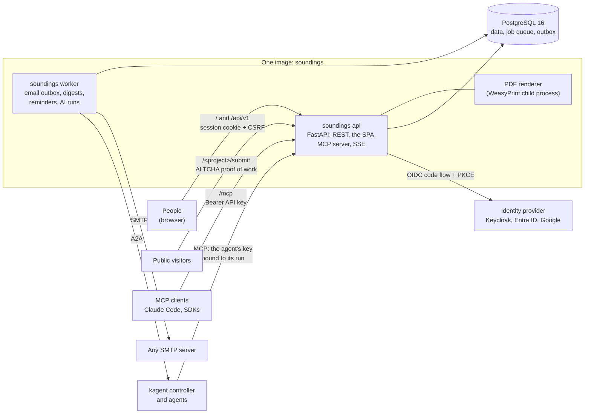

- **One image, two processes.** `soundings api` serves the REST API, the React SPA,
  the MCP server at `/mcp` and live AI progress (SSE). `soundings worker` sends email
  from a transactional outbox and runs digests, reminders and AI runs on procrastinate
  queues in PostgreSQL. There is no Redis and no message broker.
- **One policy module** decides every permission (routes, MCP tools, jobs, emails),
  deny by default. Pending evaluators see no score data anywhere, and emails never
  carry scores ([ADR 0006](docs/adr/0006-blind-evaluation-and-aggregate-scoring.md),
  [ADR 0010](docs/adr/0010-central-authorisation-policy.md)).
- **AI goes through kagent only.** The worker asks an agent over A2A. The agent works
  through `/mcp` with its own key, confined to the idea of its open run and always
  blind ([ADR 0014](docs/adr/0014-kagent-a2a-integration.md)).
- **Air-gapped**: fonts, Swagger UI and the SPA are in the image. Nothing is fetched at
  runtime and there is no telemetry.

Stack: Python 3.12, FastAPI, SQLAlchemy 2 + psycopg 3, Alembic, procrastinate,
WeasyPrint; React 19, TypeScript, Vite, Tailwind 4, TanStack Router and Query, Radix;
Helm 3. Details: [ADR 0002](docs/adr/0002-backend-stack.md).

## Repository layout

```
backend/     FastAPI app (app/), Alembic migrations, tests (pytest, testcontainers)
frontend/    React SPA and design system (src/components/ui/), vitest + Playwright on mocks
e2e/         Playwright end-to-end tests against the real stack; screenshots; perf kit
deploy/helm/ the Helm chart            deploy/kagent/  example kagent manifests
dev/         docker-compose (Postgres, Keycloak, Mailpit, a fake kagent agent), k3s values
scripts/     demo, smoke tests (SSO, email, public form, MCP, AI), local k3s helpers
docs/        guides, ADRs, decisions, role matrix, API contract, test plans, screenshots
Dockerfile   the one image (API + built SPA; `worker` and `migrate` subcommands)
```

## Contributing

Requirements: Docker, [uv](https://docs.astral.sh/uv/), Node 22.12+.

```sh
make help                 # every target
make dev-up               # Postgres, Keycloak, Mailpit in Docker
make dev                  # how to run the API, the worker and the SPA against them
make check                # every check: backend (ruff, mypy --strict, pytest), frontend
                          # (tsc, eslint, prettier, vitest, build), Helm, scripts, fake agent
npm --prefix frontend run test:pw   # Playwright + axe against the SPA's mock API
npm --prefix e2e test               # end-to-end against the real stack (Docker)
make k3s-up k3s-install k3s-smoke   # the chart on a local k3s cluster in Docker
```

Conventions that matter: the API contract comes first (Pydantic schemas, then the
generated TypeScript types: `make gen-api`); every permission goes through the policy
module; malformed input is a 4xx, never a 500; the SPA uses only design-system
components and tokens, with loading, empty and error states, dark mode, keyboard and
390 px for every screen. [CLAUDE.md](CLAUDE.md) is the full working manual (commands,
conventions and the build machine's gotchas), written for the Claude Code agents that
built Soundings and for human contributors alike.

## Licence

Not yet chosen. Until a licence is added, all rights are reserved by the authors.
Third-party components keep their own licences (the bundled fonts are under the SIL
Open Font License: `backend/app/assets/fonts/`).
