# Data model (ERD)

Schema after Phase 3: `backend/app/models/` (SQLAlchemy 2, typed), created by the
Alembic revisions `backend/app/migrations/versions/20260930_0002_domain_tables.py`
(Phase 1), `20261001_0003_sign_in_and_access.py` (Phase 2: identities, external IDs,
groups, group grants, the group-aware effective-roles view, audit indexes),
`20261001_0004_stateless_sso_sign_in.py` (Phase 2 review: drops the login-attempts
table, since sign-in attempts now travel sealed in the `soundings_oidc` cookie, and
clears plain-text ID tokens, which are now stored sealed) and
`20261001_0005_notifications_and_email.py` (Phase 3: the email outbox, in-app
notifications and email preferences) and `20261001_0006_email_cleanup_indexes.py`
(Phase 3 review: indexes for the hourly cleanup). The procrastinate job-queue tables (revision
`0001`) are not shown. API shapes are in [api/contract-phase1.md](api/contract-phase1.md),
[api/contract-phase2.md](api/contract-phase2.md) and
[api/contract-phase3.md](api/contract-phase3.md).

**Operators:** the migration runs `CREATE EXTENSION IF NOT EXISTS pg_trgm`. `pg_trgm`
is a trusted extension, so the application's database user needs `CREATE` on the
database (the database owner has it), or a DBA installs the extension beforehand.
Downgrades leave it installed.

```mermaid
erDiagram
    users ||--o{ user_sessions : "signs in with"
    users ||--o{ user_identities : "is linked to"
    users ||--o{ user_external_ids : "is known by"
    users ||--o{ group_memberships : "belongs via"
    groups ||--o{ group_memberships : has
    groups ||--o{ group_idp_values : "is mapped to"
    groups ||--o{ project_group_grants : "is granted"
    projects ||--o{ project_group_grants : "grants roles to"
    users ||--o{ project_members : "is member via"
    projects ||--o{ project_members : has
    projects ||--o{ rubric_criteria : "scores with"
    projects ||--o{ tags : defines
    projects ||--o{ ideas : contains
    users |o--o{ ideas : "owns (owner_id)"
    users |o--o{ ideas : "submitted (submitted_by_id)"
    ideas ||--o{ idea_tags : tagged
    tags ||--o{ idea_tags : "applied as"
    ideas ||--o{ idea_evaluators : "is evaluated by"
    users ||--o{ idea_evaluators : "evaluates as"
    idea_evaluators ||--o| evaluations : "writes (idea_id, evaluator_id)"
    evaluations ||--o{ evaluation_scores : contains
    rubric_criteria ||--o{ evaluation_scores : "scored in"
    ideas ||--o{ idea_votes : "voted by"
    ideas ||--o{ idea_watchers : "watched by"
    ideas ||--o{ comments : has
    users |o--o{ comments : wrote
    projects ||--o{ activity_events : logs
    ideas |o--o{ activity_events : "feed of"
    comments |o--o| activity_events : "placed by"
    users |o--o{ activity_events : "actor of"
    users ||--o{ notifications : receives
    ideas ||--o{ notifications : "is the subject of"
    comments |o--o{ notifications : "comment or mention"
    outbound_email |o--o{ notifications : "carries (immediate or digest)"
    users |o--o{ outbound_email : "is sent (recipient_user_id)"
    users ||--o{ notification_preferences : chooses

    users {
        uuid id PK
        varchar email "unique on lower(email)"
        varchar display_name
        varchar avatar_url "nullable"
        bool is_platform_admin
        bool is_active
        bool is_service_account "reserved: AI agents"
        bool is_break_glass "at most one row"
        timestamptz last_seen_at
    }
    user_sessions {
        uuid id PK
        varchar token_hash UK "sha256 of cookie token"
        uuid user_id FK
        varchar csrf_token
        varchar auth_method "sso, break_glass, dev_login"
        text id_token "SSO only, sealed, for sign-out"
        timestamptz created_at
        timestamptz last_seen_at
        timestamptz expires_at "absolute expiry"
        varchar user_agent "short summary"
    }
    user_identities {
        uuid id PK
        uuid user_id FK "unique with issuer"
        varchar issuer "unique with subject"
        varchar subject
        timestamptz created_at "linked at"
        timestamptz last_login_at
    }
    user_external_ids {
        uuid user_id PK, FK
        varchar kind PK "employee_no, gitlab"
        varchar value "unique per kind, case-insensitive"
        timestamptz created_at
    }
    groups {
        uuid id PK
        varchar name "unique on lower(name)"
        varchar description
        varchar sync_mode "managed or additive"
    }
    group_idp_values {
        uuid group_id PK, FK
        varchar value PK "normalised"
    }
    group_memberships {
        uuid group_id PK, FK
        uuid user_id PK, FK
        bool manual "admin-added; sync never touches"
        bool synced "added by sign-in sync"
    }
    project_group_grants {
        uuid project_id PK, FK
        uuid group_id PK, FK
        varchar role "admin, member, viewer"
    }
    projects {
        uuid id PK
        varchar slug UK "immutable"
        varchar key UK "immutable, CUST"
        varchar name
        text description
        varchar visibility "private or internal"
        bool allow_volunteer_owners "default true"
        bool public_submission_enabled "Phase 4"
        jsonb status_labels "overrides only"
        int default_evaluation_days "default 7"
        int next_idea_number
        timestamptz archived_at
    }
    project_members {
        uuid project_id PK, FK
        uuid user_id PK, FK
        varchar role "admin, member, viewer"
    }
    rubric_criteria {
        uuid id PK
        uuid project_id FK
        int position
        varchar name
        varchar description
        numeric weight "0.01 to 10, 2 decimals"
        bool inverted
        jsonb guidance "hints keyed 1..5"
        timestamptz archived_at
    }
    tags {
        uuid id PK
        uuid project_id FK "unique with lower(name)"
        varchar name
    }
    ideas {
        uuid id PK
        uuid project_id FK "unique with number"
        int number "key = project.key-number"
        varchar title
        varchar summary
        text description_md
        varchar status "new ... closed"
        varchar resolution "iff closed"
        uuid owner_id FK "nullable"
        uuid submitted_by_id FK "nullable"
        timestamptz evaluation_due_at
        timestamptz evaluation_closed_at
        timestamptz last_activity_at
        int vote_count "cache"
        numeric aggregate_score "cache, raw"
        int aggregate_count "cache"
        bool high_disagreement "cache"
    }
    idea_tags {
        uuid idea_id PK, FK
        uuid tag_id PK, FK
    }
    idea_evaluators {
        uuid idea_id PK, FK
        uuid user_id PK, FK
        uuid invited_by_id FK
        timestamptz invited_at
    }
    evaluations {
        uuid id PK
        uuid idea_id FK "with evaluator_id to idea_evaluators"
        uuid evaluator_id FK
        varchar status "draft, submitted"
        varchar recommendation "go, maybe, no"
        text comment
        timestamptz submitted_at "first submission"
        timestamptz edited_at "saved again after submitting"
        bool include_in_aggregate "Phase 6: AI excluded by default"
    }
    evaluation_scores {
        uuid evaluation_id PK, FK
        uuid criterion_id PK, FK
        smallint score "1..5, null in drafts"
        varchar comment
    }
    idea_votes {
        uuid idea_id PK, FK
        uuid user_id PK, FK
    }
    idea_watchers {
        uuid idea_id PK, FK
        uuid user_id PK, FK
    }
    comments {
        uuid id PK
        uuid idea_id FK
        uuid author_id FK "nullable"
        text body_md
        timestamptz edited_at
        timestamptz deleted_at
    }
    activity_events {
        uuid id PK
        uuid project_id FK
        uuid idea_id FK "nullable"
        uuid actor_id FK "nullable"
        varchar type
        uuid comment_id FK "type comment"
        jsonb payload "never scores"
        timestamptz created_at
    }
    audit_log {
        uuid id PK
        uuid actor_id "no FK"
        varchar action
        varchar target_type
        uuid target_id "no FK"
        uuid project_id "no FK"
        jsonb details
        timestamptz created_at
    }
    notifications {
        uuid id PK
        uuid user_id FK "recipient; unique with dedupe_key"
        varchar type "owner_assigned ... mention"
        uuid idea_id FK
        uuid actor_id FK "nullable: reminders"
        uuid comment_id FK "iff comment or mention"
        jsonb payload "never scores"
        varchar dedupe_key
        varchar email_mode "immediate, digest, off"
        uuid email_id FK "the email that carried it"
        timestamptz read_at
        timestamptz created_at
    }
    notification_preferences {
        uuid user_id PK, FK
        varchar type PK
        varchar mode "immediate, digest, off"
        timestamptz updated_at
    }
    outbound_email {
        uuid id PK
        varchar type "notification type, digest, test, Phase 4"
        varchar status "queued, sending, sent, failed, cancelled"
        uuid recipient_user_id FK "or to_address"
        varchar to_address "non-user recipients only"
        uuid requested_by_id FK "test email"
        jsonb payload "never scores"
        varchar message_id UK "fixed at insert"
        varchar idempotency_key UK "digest per day"
        smallint attempts
        smallint max_attempts "12; test 1"
        timestamptz next_attempt_at "queued: due; sending: lease"
        varchar last_error "sanitised"
        timestamptz sent_at
    }
```

Every table with a `uuid id` also has `created_at`, and most have `updated_at`
(timestamptz, UTC). Join tables use composite primary keys.

**View `project_effective_roles` (project_id, user_id, role):** each user's *effective*
role per project, one row per pair: the highest (`admin > member > viewer`) of the
direct role (`project_members`) and the role of every grant (`project_group_grants`) to
a group the user belongs to (`group_memberships`, manual or synced). Revision 0003
defines it as a `UNION ALL` of both sources grouped by `(project_id, user_id)` (Phase 1
it mirrored `project_members`; same columns and types). Filters on `project_id` or
`user_id` are pushed into both branches, which use the primary keys and the
`user_id`/`group_id` indexes. **Every query that needs a project role reads this view,
never `project_members`:** `list_projects`, `search_users?project=`, My work
(`evaluations_due`, `recent`), eligibility c4, last admin c11, `member_count`, the
access list and the authz policy. `project_members` is read directly only to list and
edit *direct* members, `project_group_grants` only to list and edit grants. In Python
it is `app.models.project_effective_roles` (a lightweight `table()`, kept out of
`Base.metadata` so Alembic never tries to create it).

## Conventions

- **Ids** are UUIDs generated in Python (`uuid4`), known before flush.
- **Enums** (`status`, `resolution`, `role`, `visibility`, `recommendation`) are
  `VARCHAR` plus a named `CHECK` constraint holding the wire values
  (`app/models/types.py:str_enum`), not native Postgres enums: adding a value later is
  a constraint swap. The Python `StrEnum`s in `app/models/enums.py` are shared with the
  API schemas.
- **Constraint names** follow `Base.metadata`'s naming convention (`pk_`, `fk_`, `uq_`,
  `ck_<table>_<name>`, `ix_`), so migrations can drop them by name.
- **Timestamps** are `timestamptz`, set in Python (UTC) with `now()` server defaults.
- **Soft vs hard delete:** users are deactivated (`is_active`), projects archived
  (`archived_at`), rubric criteria archived once scored, comments soft-deleted
  (`deleted_at`, body cleared). Ideas are hard-deleted by admins, with everything
  under them.
- **Schema checks:** `tests/test_domain_schema.py` runs upgrade → downgrade → upgrade on
  a scratch database, `alembic check`, and compares every constraint, index and column
  of the migrated schema with `Base.metadata.create_all` (stricter than autogenerate,
  which ignores `CHECK` constraints and index operator classes).

## Table notes

| Table | Notes |
|---|---|
| `users` | Email unique case-insensitively (`uq_users_email_lower` on `lower(email)`); look up with `lower(email) = lower(:email)`. Never deleted in normal use (deactivate). A pre-created user is a normal row without an identity. `is_service_account` is reserved for Phase 5/6 agent accounts. `is_break_glass` marks the single break-glass admin (`uq_users_is_break_glass`, partial unique on `is_break_glass` where true), created at its first sign-in with the reserved address `break-glass@soundings.invalid` (`.invalid` emails can't be given to users). Login matching never selects service or break-glass accounts. Downgrading 0003 leaves that row as an ordinary user; upgrading again marks it as the break-glass account by its email. |
| `user_sessions` | Cookie holds a 256-bit random token; only its SHA-256 (`token_hash`) is stored. `csrf_token` is mirrored in the readable `soundings_csrf` cookie. `expires_at` is the absolute expiry; idle expiry is `last_seen_at` + idle timeout (settings). `auth_method` (`sso`, `break_glass`, `dev_login`; no server default, existing rows became `dev_login`) says how it started; a session only works while that method is available (break-glass sessions also at most 8 hours, 1 hour idle). `id_token` (SSO only, and only when the token is at most 3,072 characters) is kept solely as `id_token_hint` for RP-initiated logout, sealed (AES-256-GCM with a key derived from the secret key, `app/auth/sealing.py`; [ADR 0005](adr/0005-server-side-sessions-oidc-csrf.md)); never logged or returned. Revision 0004 cleared plain-text tokens (those sessions sign out without the hint). Downgrading 0003 deletes SSO and break-glass sessions. |
| `user_identities` | An OIDC account linked to a user: the ID token's `(iss, sub)`, unique (`uq_user_identities_issuer_subject`), and at most one per user per issuer (`uq_user_identities_user_id_issuer`). Linked at the first sign-in that matches the user; `last_login_at` is updated at every SSO sign-in. Admins can unlink one (the user is matched again next time). |
| `user_external_ids` | Admin-managed ids (`employee_no = E1001`) that link a pre-created user at first sign-in. One value per kind per user (primary key `(user_id, kind)`); `(kind, lower(value))` unique (`uq_user_external_ids_kind_value_lower`). `kind` matches `^[a-z][a-z0-9_]{0,39}$`. |
| `groups` | Internal groups; names unique case-insensitively (`uq_groups_name_lower`). `sync_mode` (`managed` default, `additive`) decides what sign-in sync does with synced memberships. |
| `group_idp_values` | IdP group values mapped to a group, stored normalised (trim, strip `/` at both ends, lower-case); primary key `(group_id, value)`, indexed by `value` for the sign-in lookup. A value may map to several groups. |
| `group_memberships` | One row per (group, user) with provenance flags `manual` (admin) and `synced` (sign-in sync); `ck_group_memberships_has_source` keeps at least one true. Sync sets and clears only `synced` (deleting the row when neither is left); admins set `manual`, and "remove member" deletes the row. Sync and the admin add/remove both lock the user's `users` row first, so they serialise. Indexed by `user_id`. Deactivated users' rows stay (they can't sign in) and don't count for c11 or member counts. |
| `project_group_grants` | A project role for every member of a group; primary key `(project_id, group_id)`, indexed by `group_id`. Feeds the effective-roles view. |
| `projects` | `slug` (URLs) and `key` (idea keys) are immutable. `key` matches `^[A-Z][A-Z0-9]{1,5}$`. `status_labels` stores overrides only, keyed by status and resolution values. `next_idea_number` is allocated with `UPDATE ... SET next_idea_number = next_idea_number + 1 RETURNING next_idea_number - 1` (race-free, numbers never reused). `archived_at` makes the project read-only and hides it by default. `public_submission_enabled` is Phase 4. |
| `project_members` | Direct membership only. Group grants are in `project_group_grants`; the `project_effective_roles` view (above) combines both, and queries read the view. |
| `rubric_criteria` | 3–6 active (`archived_at IS NULL`) per project, ordered by `position`. Active names are unique per project, case-insensitively (`uq_rubric_criteria_project_id_name_lower`, partial on `archived_at IS NULL`; unique indexes aren't deferrable, so `replace_rubric` applies renames and archives before inserts). `weight` is `numeric(4,2)`, `> 0`; the API accepts 0.01–10 in steps of 0.01 so nothing rounds to 0. Criteria with scores are archived when removed from the rubric; unscored ones are deleted. Scores reference criteria with a `NO ACTION` FK that is `DEFERRABLE INITIALLY DEFERRED`: deleting a scored criterion fails **at commit**, while deleting the whole project (which cascades to scores too) succeeds. New projects get `app/domain/rubric_defaults.py`. |
| `tags` | Per project, created on first use; unique on `(project_id, lower(name))`, first spelling wins. Rows are never deleted; `list_project_tags` lists only tags on at least one idea, so typos drop out of the chips once no idea uses them. |
| `ideas` | `(project_id, number)` unique; key = `project.key || '-' || number`. `resolution` set iff `status = 'closed'` (`ck_ideas_resolution_iff_closed`). Cached, **unmasked** aggregate: `aggregate_score` (1 decimal), `aggregate_count`, `high_disagreement`, recomputed in the same transaction as any evaluation, evaluator or rubric change; blind masking is applied per viewer when reading ([ADR 0006](adr/0006-blind-evaluation-and-aggregate-scoring.md)). `vote_count` caches `idea_votes`. `last_activity_at` is bumped by every activity event. Search: `ILIKE '%q%'` on `title`/`summary` served by `pg_trgm` GIN indexes. Indexes for board/list keyset pages in the default order: `(project_id, last_activity_at, id)` and `(project_id, status, last_activity_at, id)` (also the per-status counts); plus `(project_id, aggregate_score)`, `owner_id`, `last_activity_at` (cross-project My work). Phase 3 reminder scan: partial index `ix_ideas_evaluation_due_at_open` on `evaluation_due_at` where it is set and evaluation is open. Phase 4 adds public-submitter fields (hashed tracking token, contact email, moderation flag). |
| `idea_evaluators` | The assignment. AI evaluators (Phase 6) are service-account users, so no extra column: `is_ai` in the API is `users.is_service_account`. Indexed by `user_id` for My work. |
| `evaluations` | One per assignment: composite FK `(idea_id, evaluator_id)` → `idea_evaluators` with `ON DELETE CASCADE`, so removing the assignment removes the evaluation. Created on first save. `submitted` requires `recommendation` and `submitted_at` (`ck_evaluations_submitted_complete`). `submitted_at` is the first submission; `edited_at` is the last save after it (null if none; the UI shows "edited after submission"). Whether an evaluation is AI is `users.is_service_account` of the evaluator (no column here); `include_in_aggregate` is for Phase 6 (AI excluded by default). |
| `evaluation_scores` | `score` 1–5 (`ck_evaluation_scores_score_range`), null only in drafts. `criterion_id` FK is deferred (see `rubric_criteria`). |
| `idea_votes`, `idea_watchers` | One row per user per idea. Watchers are added automatically for the submitter, owner, evaluators and commenters (Phase 3 notifications). |
| `comments` | Flat. Every comment also has an `activity_events` row (`type = 'comment'`, `comment_id`) that places it in the feed. Deleting sets `deleted_at` and clears `body_md`. |
| `activity_events` | The idea feed and, from Phase 3, the source of notifications. `type` is validated in the application (the set grows per phase); `payload` holds ids and from/to values and **never scores**. `idea_id` is nullable for future project-level events. Feed index `(idea_id, created_at, id)`. |
| `notifications` | The in-app inbox and the record of who was told what ([contract-phase3 §3.2–3.3](api/contract-phase3.md#33-fan-out-which-events-notify-whom)). One row per recipient and event, written by the fan-out in the event's transaction; `uq_notifications_user_id_dedupe_key` (`<type>:<event id>`, `mention:<comment id>`, `evaluation_reminder:<idea id>:<local due date>:<days before>`) makes the fan-out, the reminder scan and retries idempotent, and **is** the reminder bookkeeping. `idea_id` is required (every type is about one idea); `comment_id` is set exactly for `comment` and `mention` (`ck_notifications_comment_iff_comment_type`). `payload` holds the type's data (from/to status, due date, days before, submitted count), never scores. `email_mode` is the recipient's preference when it was created (`off` also when email isn't configured or the address is unusable); `email_id` is the outbox row that carried it: its own immediate email, or the digest that collected it. **Digest bookkeeping:** pending = `email_mode = 'digest' AND email_id IS NULL` (`ix_notifications_digest_pending`), and only items from the last 7 days are collected; the hourly cleanup sets `email_mode = 'off'` on older pending items, including those whose digest row was pruned (`email_id` back to null), so nothing is mailed twice; `ck_notifications_no_email_when_off`. Indexes: inbox `(user_id, created_at, id)`, unread (partial on `read_at IS NULL`), `email_id`, `comment_id` (partial), `idea_id`, `ix_notifications_mention_actor (actor_id, created_at)` partial on `type = 'mention'` (the per-author cap on mention emails), and `ix_notifications_created_at` (revision 0006: the 90-day cleanup). Deleted after 90 days. |
| `notification_preferences` | A user's email mode per notification type, only where it differs from the defaults in code (`app.schemas.notifications.DEFAULT_MODES`); primary key `(user_id, type)`. |
| `outbound_email` | The transactional outbox ([ADR 0003](adr/0003-background-jobs-procrastinate-and-email-outbox.md), [contract-phase3 §3.9](api/contract-phase3.md#39-the-outbox-and-the-worker)). One row per email, inserted with its `send_email` job in the event's transaction; the row is the truth. Exactly one recipient: `recipient_user_id` (address looked up at send time, and checked to be one plain address) or `to_address` (a test email to an address; Phase 4 public submitters), `ck_outbound_email_one_recipient`. Content is rendered at send time from the notifications pointing at it, so no subject or body is stored. `status`: `queued` (waiting for `next_attempt_at`), `sending` (claimed; `next_attempt_at` is the 5-minute lease), `sent` (`sent_at` set, `ck_outbound_email_sent_at_iff_sent`), `failed` (admins may retry it for 3 days, digests 2), `cancelled` (by the send-time checks); `next_attempt_at` is set exactly while queued or sending (`ck_outbound_email_next_attempt_iff_pending`). `message_id` is unique and fixed at insert (a resend after a crash has the same Message-ID); `idempotency_key` unique when set (`digest:<user id>:<local date>`; Phase 4 per submission). `attempts`/`max_attempts` (12, test emails 1) drive the capped exponential backoff; `last_error` is a phrase built by our code, never the server's text. `payload` is for what can't be looked up at send time (Phase 4: the sealed tracking link). Indexes: the due partial index on `next_attempt_at` (status queued or sending) for claims and the sweep, `(created_at, id)` and `(status, created_at, id)` for the admin outbox, counts and the admins' "email failing" flag, `recipient_user_id`, and `ix_outbound_email_status_updated_at (status, updated_at)` (revision 0006: the cleanup and the 24-hour failure check). Sent and cancelled rows are deleted after 30 days, failed after 90 (hourly cleanup). Phase 4 adds an `idea_id` for public-submitter mail. |
| `audit_log` | Append-only. No foreign keys, so entries outlive what they mention. `details` holds ids, enum values, field names, the IdP issuer/subject and group mapping values; never secrets, tokens, emails or claims. The admin viewer pages newest first on `ix_audit_log_created_at_id (created_at, id)`; its filters use `(actor_id, created_at)`, `(action, created_at)`, `(project_id, created_at)` and `(target_type, target_id)`. Actions: `app.schemas.audit.AuditAction`. |

## Delete behaviour

| Deleting | Effect |
|---|---|
| a project | Cascades to members, rubric, tags, ideas and everything under them, activity. |
| an idea | Cascades to tags, evaluators → evaluations → scores, votes, watchers, comments, activity. |
| an evaluator assignment | Cascades to their evaluation and scores. |
| a user (not a feature: users are deactivated) | Sessions, identities, external IDs, project and group memberships, assignments, votes and watches cascade; `owner_id`, `submitted_by_id`, `invited_by_id`, comment authors and activity actors become null. |
| a group | Cascades to its IdP values, memberships and project grants: access through it ends at once. |
| a project | Also cascades to its group grants. |
| a scored rubric criterion | Refused by the database at commit (deferred FK); archive it instead. |
| an idea (Phase 3) | Also cascades to its notifications; immediate emails about it lose their notification and are cancelled at send time ("no longer applies"). |
| a user (Phase 3) | Also cascades to their notifications, preferences and outbox rows addressed to them; `actor_id` and `requested_by_id` become null. |
| an outbox row (cleanup) | Its notifications stay, with `email_id` null; the same cleanup then turns pending digest items older than 7 days `off`, so a pruned digest's items never look pending again. |

## Invariants the application enforces

The database does not check these (they span tables); the backend validates them in the
same transaction and tests them:

- A score's criterion belongs to the evaluated idea's project (else 422 `unknown_criterion`).
- An idea's tags belong to the idea's project.
- An activity event's `project_id` is its idea's project.
- A submitted evaluation has a non-null score for every active criterion (422
  `evaluation_incomplete`).
- `ideas.vote_count` and the aggregate cache match their source rows.
- Service and break-glass accounts have no identities, external IDs, project roles or
  group memberships (the break-glass admin acts as platform admin only).
- `group_idp_values.value` is already normalised
  (`app.schemas.groups.normalise_idp_value`).
- A notification's recipient passed `idea.view` when it was created; an email goes out
  only if they still do (re-checked at send time, contract-phase3 §3.9).
- A notification's `comment_id` belongs to its idea; an outbox row's notifications all
  have the row's recipient.
- No notification `payload` or outbox `payload` holds score data.
