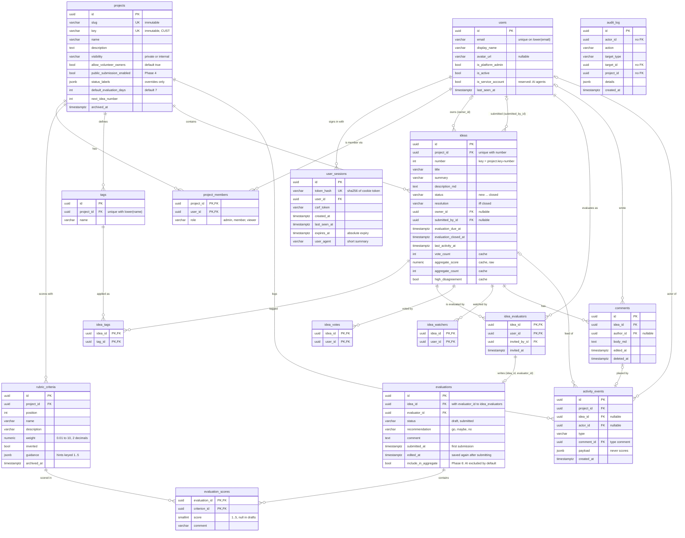

# Data model (ERD)

Phase 1 schema: `backend/app/models/` (SQLAlchemy 2, typed), created by the Alembic
revision `backend/app/migrations/versions/20260930_0002_domain_tables.py`. The procrastinate
job-queue tables (revision `0001`) are not shown. API shapes are in
[api/contract-phase1.md](api/contract-phase1.md).

**Operators:** the migration runs `CREATE EXTENSION IF NOT EXISTS pg_trgm`. `pg_trgm`
is a trusted extension, so the application's database user needs `CREATE` on the
database (the database owner has it), or a DBA installs the extension beforehand.
Downgrades leave it installed.

Every table with a `uuid id` also has `created_at`, and most have `updated_at`
(timestamptz, UTC). Join tables use composite primary keys.

**View `project_effective_roles` (project_id, user_id, role):** each user's *effective*
role per project, one row per pair. Phase 1 it is `SELECT project_id, user_id, role
FROM project_members`; Phase 2 redefines it (same columns) as the highest of the direct
and group-granted roles (`admin > member > viewer`). **Every query that needs a project
role reads this view, never `project_members`:** `list_projects`, `search_users?project=`,
My work (`evaluations_due`, `recent`), eligibility c4, last admin c11, and the authz
policy. `project_members` is read directly only to list and edit *direct* members.
In Python it is `app.models.project_effective_roles` (a lightweight `table()`, kept
out of `Base.metadata` so Alembic never tries to create it).

## Conventions

- **Ids** are UUIDs generated in Python (`uuid4`), known before flush.
- **Enums** (`status`, `resolution`, `role`, `visibility`, `recommendation`) are
  `VARCHAR` plus a named `CHECK` constraint holding the wire values
  (`app/models/types.py:str_enum`), not native Postgres enums: adding a value later is
  a constraint swap. The Python `StrEnum`s in `app/models/enums.py` are shared with the
  API schemas.
- **Constraint names** follow `Base.metadata`'s naming convention (`pk_`, `fk_`, `uq_`,
  `ck_<table>_<name>`, `ix_`), so migrations can drop them by name.
- **Timestamps** are `timestamptz`, set in Python (UTC) with `now()` server defaults.
- **Soft vs hard delete:** users are deactivated (`is_active`), projects archived
  (`archived_at`), rubric criteria archived once scored, comments soft-deleted
  (`deleted_at`, body cleared). Ideas are hard-deleted by admins, with everything
  under them.
- **Schema checks:** `tests/test_domain_schema.py` runs upgrade → downgrade → upgrade on
  a scratch database, `alembic check`, and compares every constraint, index and column
  of the migrated schema with `Base.metadata.create_all` (stricter than autogenerate,
  which ignores `CHECK` constraints and index operator classes).

## Table notes

| Table | Notes |
|---|---|
| `users` | Email unique case-insensitively (`uq_users_email_lower` on `lower(email)`); look up with `lower(email) = lower(:email)`. Never deleted in normal use (deactivate). `is_service_account` is reserved for Phase 5/6 agent accounts. Phase 2 adds `user_identities` (issuer, subject) and `user_external_ids`. |
| `user_sessions` | Cookie holds a 256-bit random token; only its SHA-256 (`token_hash`) is stored. `csrf_token` is mirrored in the readable `soundings_csrf` cookie. `expires_at` is the absolute expiry; idle expiry is `last_seen_at` + idle timeout (settings). Phase 2 adds the ID token for RP-initiated logout ([ADR 0005](adr/0005-server-side-sessions-oidc-csrf.md)). |
| `projects` | `slug` (URLs) and `key` (idea keys) are immutable. `key` matches `^[A-Z][A-Z0-9]{1,5}$`. `status_labels` stores overrides only, keyed by status and resolution values. `next_idea_number` is allocated with `UPDATE ... SET next_idea_number = next_idea_number + 1 RETURNING next_idea_number - 1` (race-free, numbers never reused). `archived_at` makes the project read-only and hides it by default. `public_submission_enabled` is Phase 4. |
| `project_members` | Direct membership only. **Phase 2 extension point:** group grants go in a separate `project_group_grants (project_id, group_id, role)` table, and the `project_effective_roles` view (above) combines both; queries read the view. |
| `rubric_criteria` | 3–6 active (`archived_at IS NULL`) per project, ordered by `position`. Active names are unique per project, case-insensitively (`uq_rubric_criteria_project_id_name_lower`, partial on `archived_at IS NULL`; unique indexes aren't deferrable, so `replace_rubric` applies renames and archives before inserts). `weight` is `numeric(4,2)`, `> 0`; the API accepts 0.01–10 in steps of 0.01 so nothing rounds to 0. Criteria with scores are archived when removed from the rubric; unscored ones are deleted. Scores reference criteria with a `NO ACTION` FK that is `DEFERRABLE INITIALLY DEFERRED`: deleting a scored criterion fails **at commit**, while deleting the whole project (which cascades to scores too) succeeds. New projects get `app/domain/rubric_defaults.py`. |
| `tags` | Per project, created on first use; unique on `(project_id, lower(name))`, first spelling wins. Rows are never deleted; `list_project_tags` lists only tags on at least one idea, so typos drop out of the chips once no idea uses them. |
| `ideas` | `(project_id, number)` unique; key = `project.key || '-' || number`. `resolution` set iff `status = 'closed'` (`ck_ideas_resolution_iff_closed`). Cached, **unmasked** aggregate: `aggregate_score` (1 decimal), `aggregate_count`, `high_disagreement`, recomputed in the same transaction as any evaluation, evaluator or rubric change; blind masking is applied per viewer when reading ([ADR 0006](adr/0006-blind-evaluation-and-aggregate-scoring.md)). `vote_count` caches `idea_votes`. `last_activity_at` is bumped by every activity event. Search: `ILIKE '%q%'` on `title`/`summary` served by `pg_trgm` GIN indexes. Indexes for board/list keyset pages in the default order: `(project_id, last_activity_at, id)` and `(project_id, status, last_activity_at, id)` (also the per-status counts); plus `(project_id, aggregate_score)`, `owner_id`, `last_activity_at` (cross-project My work). Phase 3 reminder scan: partial index `ix_ideas_evaluation_due_at_open` on `evaluation_due_at` where it is set and evaluation is open. Phase 4 adds public-submitter fields (hashed tracking token, contact email, moderation flag). |
| `idea_evaluators` | The assignment. AI evaluators (Phase 6) are service-account users, so no extra column: `is_ai` in the API is `users.is_service_account`. Indexed by `user_id` for My work. |
| `evaluations` | One per assignment: composite FK `(idea_id, evaluator_id)` → `idea_evaluators` with `ON DELETE CASCADE`, so removing the assignment removes the evaluation. Created on first save. `submitted` requires `recommendation` and `submitted_at` (`ck_evaluations_submitted_complete`). `submitted_at` is the first submission; `edited_at` is the last save after it (null if none; the UI shows "edited after submission"). Whether an evaluation is AI is `users.is_service_account` of the evaluator (no column here); `include_in_aggregate` is for Phase 6 (AI excluded by default). |
| `evaluation_scores` | `score` 1–5 (`ck_evaluation_scores_score_range`), null only in drafts. `criterion_id` FK is deferred (see `rubric_criteria`). |
| `idea_votes`, `idea_watchers` | One row per user per idea. Watchers are added automatically for the submitter, owner, evaluators and commenters (Phase 3 notifications). |
| `comments` | Flat. Every comment also has an `activity_events` row (`type = 'comment'`, `comment_id`) that places it in the feed. Deleting sets `deleted_at` and clears `body_md`. |
| `activity_events` | The idea feed and, from Phase 3, the source of notifications. `type` is validated in the application (the set grows per phase); `payload` holds ids and from/to values and **never scores**. `idea_id` is nullable for future project-level events. Feed index `(idea_id, created_at, id)`. |
| `audit_log` | Append-only, filled from Phase 2. No foreign keys, so entries outlive what they mention. Never store secrets or tokens in `details`. |

## Delete behaviour

| Deleting | Effect |
|---|---|
| a project | Cascades to members, rubric, tags, ideas and everything under them, activity. |
| an idea | Cascades to tags, evaluators → evaluations → scores, votes, watchers, comments, activity. |
| an evaluator assignment | Cascades to their evaluation and scores. |
| a user (not a Phase 1 feature) | Sessions, memberships, assignments, votes and watches cascade; `owner_id`, `submitted_by_id`, `invited_by_id`, comment authors and activity actors become null. |
| a scored rubric criterion | Refused by the database at commit (deferred FK); archive it instead. |

## Invariants the application enforces

The database does not check these (they span tables); the backend validates them in the
same transaction and tests them:

- A score's criterion belongs to the evaluated idea's project (else 422 `unknown_criterion`).
- An idea's tags belong to the idea's project.
- An activity event's `project_id` is its idea's project.
- A submitted evaluation has a non-null score for every active criterion (422
  `evaluation_incomplete`).
- `ideas.vote_count` and the aggregate cache match their source rows.
